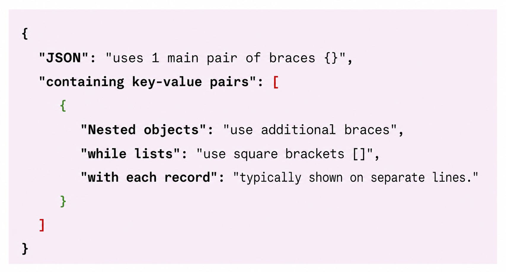
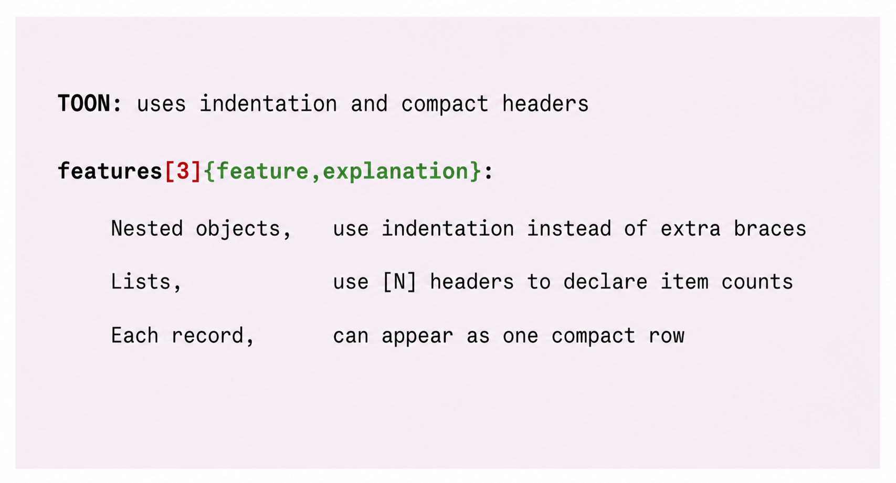

# JSON vs TOON: Supply Chain Demo

A small Node.js experiment that serializes the same fictional warehouse outbound wave as readable JSON and TOON, then compares the character and UTF-8 byte sizes of those two specific outputs.

## What this demonstrates

The demo shows how one uniform collection of warehouse order records is represented as formatted JSON and as TOON. It reports the structural size of each generated file in characters and UTF-8 bytes.

The measured difference applies only to this dataset, these serialization settings, and the package version recorded in `package-lock.json`. Different data shapes or formatting choices can produce different results.

## Architectural position

JSON remains the de facto interoperability format across REST and GraphQL payloads, APIs, OpenAPI, JSON Schema, integration messaging, contracts, configuration, persistence, and general-purpose tooling. Existing WMS, ERP, TMS, event-driven platforms, and other legacy or current systems already rely on those contracts and integrations.

[TOON (Token-Oriented Object Notation)](https://github.com/toon-format/toon) is evaluated here as **a possible representation for structured data at the application-to-LLM boundary**. Uniform records can use TOON's tabular form, which may reduce repeated structural syntax for some datasets. This is context-dependent and should be measured with the actual data, model, and tokenizer.

One possible architecture is:

```text
Application
    │
   JSON
    │
AI Gateway
    │
JSON → TOON
    │
   LLM
    │
TOON → JSON
    │
Application
```

This diagram is an architectural discussion, not an industry recommendation. It keeps JSON at established system boundaries and considers TOON only as an optional translation inside an AI gateway or similar adapter.

## What this does not demonstrate

This repository does not demonstrate or recommend:

- replacing JSON in APIs, REST or GraphQL payloads, contracts, schemas, persistence, or configuration;
- replacing Kafka, RabbitMQ, EventBridge, or other integration and event-messaging formats;
- that TOON is always smaller, faster, or better than JSON;
- improved LLM accuracy, latency, throughput, or cost;
- a production AI gateway or a complete TOON round trip; or
- a model-specific token reduction.

TOON is not presented as a general replacement for JSON. It is one possible optimization to evaluate at a specific boundary.

## Bytes, characters, and tokens

The demo compares characters and UTF-8 bytes, not LLM tokens. Byte and character reductions are not equivalent to token savings. Tokenizer implementations differ, and any actual token change depends on the selected model, tokenizer, data shape, and serialization options. The comparison shown here is structural rather than tokenizer-specific; evaluate token counts separately with the exact production tokenizer before drawing conclusions.

All warehouse, customer, and order details are fictional.

For a practical walkthrough and evaluation checklist, see [How to Use This Demo](HOW_TO_USE.md).

## Structure at a glance

<table>
  <tr>
    <th width="50%">JSON</th>
    <th width="50%">TOON</th>
  </tr>
  <tr>
    <td></td>
    <td></td>
  </tr>
</table>

These illustrations explain the formats' visible structure; they are not performance benchmarks or architectural recommendations.

## Run the demo

Requirements: Node.js 20 or newer and npm.

```bash
npm install
npm run demo
```

The command regenerates:

- `output/warehouse-orders.json`
- `output/warehouse-orders.toon`

It also prints a comparison table, absolute character and byte differences, percentage reductions for this generated example, and the exact output paths. The terminal note identifies the measurements as distinct from LLM token counts.

## Prepare the VS Code screenshot

1. Open this project folder in VS Code.
2. Open `output/warehouse-orders.json`.
3. In the Explorer, right-click `output/warehouse-orders.toon` and select **Open to the Side**.
4. Run `npm run demo` in the integrated terminal.
5. Resize the terminal so the complete table, reduction lines, note, and both generated paths remain visible.
6. Collapse the Explorer sections you do not need, then hide the Explorer with `Ctrl+B` (`Cmd+B` on macOS) for minimal clutter.
7. Keep both editor panes near their first line. The screenshot should include the warehouse/wave header, JSON order objects, TOON tabular header and rows, and the complete terminal summary.

For a readable capture, use a moderate editor zoom and make the two editor panes approximately equal width.

## Project structure

```text
json-vs-toon-supply-chain-demo/
├── assets/
│   ├── json-structure.png
│   └── toon-structure.png
├── src/generate-comparison.mjs
├── output/warehouse-orders.json
├── output/warehouse-orders.toon
├── package.json
├── package-lock.json
├── README.md
├── HOW_TO_USE.md
└── .gitignore
```

## License

MIT
